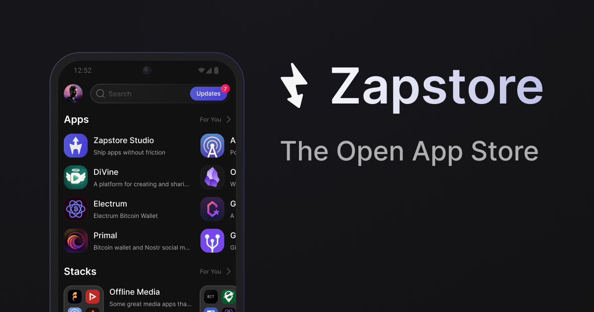

# Zapstore

[](https://github.com/zapstore/zapstore/releases)
[](LICENSE.md)
[](https://flutter.dev)

**Zapstore is an open Android app store where apps can be published directly by developers and curated by communities.**

It combines app discovery, publisher identity, direct APK distribution, and social trust signals into a different model for Android app distribution.

This repo is the [Flutter](https://flutter.dev) mobile app for [Zapstore](https://zapstore.dev). Listings and publisher identity sync from Nostr relays; APKs are verified (file hash and signing certificate) before install.

<p align="center">
  
</p>

## Get the app

[GitHub Releases](https://github.com/zapstore/zapstore/releases) (APK) · Install from Zapstore (badge below)

<p align="center">
  <a href="https://zapstore.dev/apps/naddr1qvzqqqr7pvpzq7xwd748yfjrsu5yuerm56fcn9tntmyv04w95etn0e23xrczvvraqqgxgetk9eaxzurnw3hhyefwv9c8qakg5jt">
    
  </a>
</p>

## Build from source

Flutter **3.38.6** (see [`.fvmrc`](.fvmrc); [FVM](https://fvm.app) optional). Android SDK required for APK builds.

```bash
flutter pub get
flutter build apk --split-per-abi --debug
```

Output: `build/app/outputs/flutter-apk/`

```bash
flutter analyze && flutter test
```

## Docs in this repo

- [Changelog](CHANGELOG.md)
- [Architecture & guidelines](spec/guidelines/) (for contributors and agents)

## Contributing

Minor fixes: PRs welcome. For larger changes, please reach out first while the project is in beta.

Tested with [BrowserStack](https://www.browserstack.com/).

## License

[MIT](LICENSE.md)
